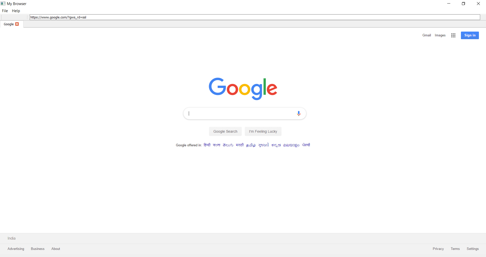
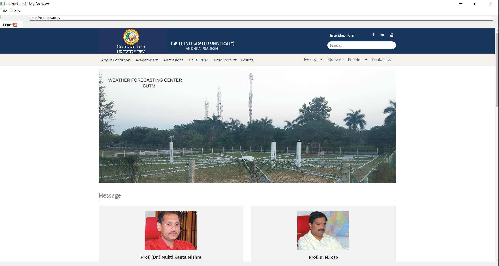

# Python Web Browser 
> A Simple fully functional Web Browser Built using python and PyQt module.

## Table of contents
* [General info](#general-info)
* [Screenshots](#screenshots)
* [Technologies](#technologies)

## General info
This file can be used as a complete web browser (Need to run the python files)

## Screenshots

## Technologies
* Python == 3.8
* PyQt == 5
